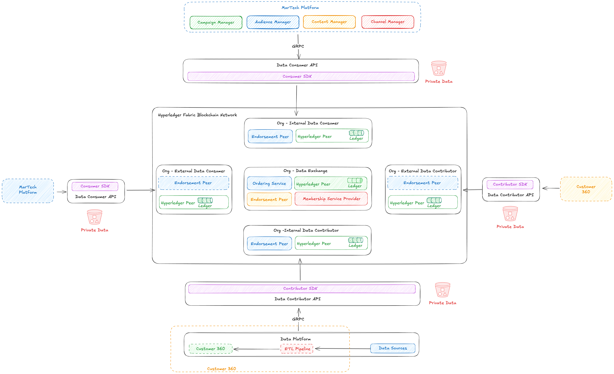

# Data Exchange Architecture and Design

## AI Day Requirements
1. Campaign creation
2. Audience selection (federation)
3. Campaign approval
4. Campaign execution
5. Personalisation - Language + content (preferred)

## Hyperledger Fabric Concept

Reference - https://hyperledger-fabric.readthedocs.io/en/latest/key_concepts.html

1. Identity and Membership Service Provider
2. Block Chain (Immutable Ledger and World State)
3. Transactions (One block consist of multiple transactions)
4. Peers (Stores ledger on blockchain)
5. Smart Contracts or Chain Code (business logic on blockchain)
6. Endrosement Peers (Run Chain Code on block chain)
7. Ordering Service (Order transactions on blocks)
8. Channels (Make ledger visible to few participants)

### Data Exchange specific Hyperledger Fabric services
1. Membership Service Provider (Owned by Data Exchange) - Used during onboarding of data contributor and data consumers
2. Peers & Block Chain - Potentially owned by all participants in network (Data Exchange, data contributor and data consumers)
3. Endrosement Peers - One owned by data exchange and other participant can optionally run it independedntly
4. Ordering Service - Owned by Data Exchange

## Blockchain Ledger
#### Consumer Ledger
1. Each consumer will have one ledger each
2. Ledger in channel will be visible to specific consumer and data exchange
3. Ledger contents for request - consumer id, request id, request payload (Attribute list)
4. Ledger contents for response - consumer id, request id, response payload (Hash of data or actual data)

#### Contributor Ledger
1. Each contributor will have one ledger each
2. Ledger in channel will be visible to specific contributor and data exchange
3. Ledger contents for request - contributor id, sub request id, sub request payload (Subset of original attribute list)
4. Ledger contents for response - consumer id, request id, response payload (Hash of data or actual data)

#### Aggregation and Dissimation Ledger
1. This ledger will be visible to all.
2. Request Dissimation - Parent Request id, multiple sub request ids
3. Response Aggregation - Parent Request id, multiple sub request ids, multiple sub response ids from each contributor, aggregated response
4. Participant will able to see only there own data but unable to see others data. They will be able to aggreegated statistics

## Chain code
1. Intersection finder
2. Request Dissimation (Encapsulate contributor attribute priority)
3. Response Aggregation

## Architecture Diagram

## Services
### Master data service
Responsibilities
1. Onboard attributes
2. Manage contributors (CRUD)
3. Manage consumers (CRUD)

### Onboarding service
Responsibilities
1. Data contributor onboarding
2. Data consumner onboarding
3. Interaction with MSP for onboarding
4. Create identites for each participants
5. Manage RBAC

### Admin service
Responsibilities
1. User management
2. Authentication 
3. Authorisation

### Data exchange API (Rest API end points)
1. Put request to blockchain as data consumer
2. Read response from block chain as data consumer
3. Read request from blockchain as data contributor
4. Write response to blockchain as data contributor

## Marktech Platform
### Campaign Manager
1. Create campaigns
2. Execute campaigns

### Audience Manager 
1. CRUD for Cohort

### Content Manager
1. Create email template
2. Create sms template
3. Create whatsapp text message template
4. Create and manage image template
5. Create and manage video template

### Channel Manager
1. SMS based client onboarding
2. Email specific client onboarding
3. Whatsapp specific client onboarding
4. Instagram or facebook???
5. YouTube ???
6. LinkedIn and Twitter??

## Customer 360
1. Profile Store
2. Configurable Spark based pipeline