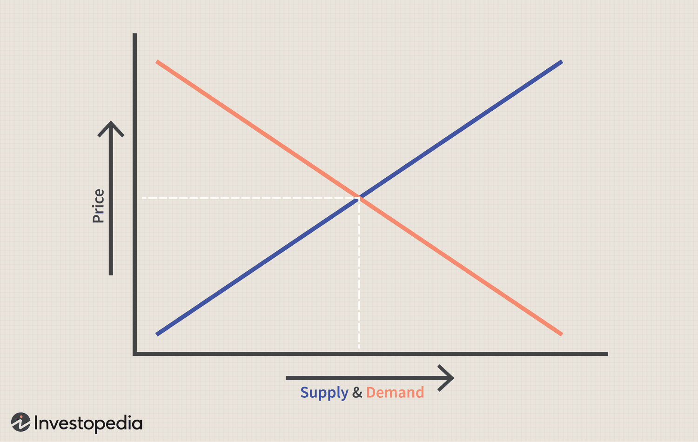
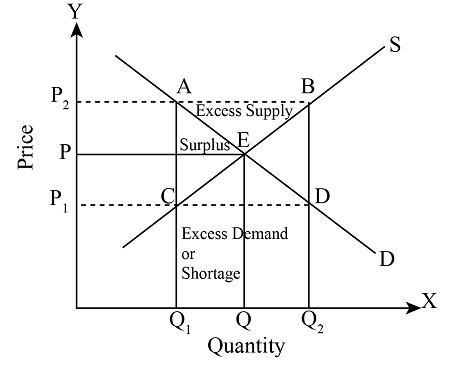

## Links
1. Supply & Demand - https://www.youtube.com/watch?v=kIFBaaPJUO0 & https://www.youtube.com/watch?v=LwLh6ax0zTE
2. Elasticity of Demand - https://www.youtube.com/watch?v=HHcblIxiAAk
3. Elasticity Overview and Tips - https://www.youtube.com/watch?v=eylEJ8OKFKE 
4. Elasticity Practice- Supply and Demand - https://www.youtube.com/watch?v=nAT_shQGlIk

1. Micro Unit 2: Supply and Demand - https://www.youtube.com/watch?v=dPalOrykGA8&list=PL6B2DBE4C2FC8F845
2. 

Demand and Supply Explained Part 2 - Macro Topic 1.5 - https://www.youtube.com/watch?v=ewPNugIqCUM

Elasticity of Demand- Micro Topic 2.3 - https://www.youtube.com/watch?v=HHcblIxiAAk
Elasticity Overview and Tips- Micro Topics 2.3, 2.4, and 2.5 - https://www.youtube.com/watch?v=eylEJ8OKFKE

## Notes
### Demand
Law of demand - Inverse relationship between price and quantity demanded

Reson for downward slope
1. Substitution Effect - if price go up people will buy cheap substitutes and if price go down people will move away from substitutes
2. Income effect - if price go down purchasing power increases and if price go up purchasing power decrease
3. Law od dimnishing utility - as you continue to consume a given product you will get less additional utility/satisfaction

#### Demand shift

5 shifters of demand
1. Taste & Preference
2. Number of consumers
3. Price of related good - substitutes (indigo vs vistara) and complements (airlines and hotels)
4. Income - Inferior good and Normal Good (normal vs business class)
5. Expectations - if prices will rise before holiday at destiation. Demand on a day before will increase. vice versa

> Change in quantity demanded vs change in demand are different. Moving along demand curve change quantity demanded. Shift of demand curv change demand

### Supply
Law of supply - direct relationship between price and quantity demanded. When price of commodity increases, number of supplier increases. When price of quantity decreases number of supplier decreases.

#### Supply Shift
5 shifters of supply
1. Prices of resources - if fuel price increases supply will decrease.
2. Number of producers - number of airlines
3. Technology - 
4. Taxes and Subsidies - 
5. Expectations - if supplier believe that it will make more profit from now it will hold back supply now

> Change in quantity supply vs change in supply are different. Moving along supply curve change quantity supplied. Shift of supply curv change supply

### Equilibrium Price

#### Surplus & Shortage

### Elasticity of Demand
How sensitive is quantity demanded on change of price

Coefficient of Elasticity
1. Perfect Inelastic = 0
2. Inelastic < 1
3. Unit elastic = 1
4. Elastic > 1
5. Perfect elastic = infinite

#### Total Revenue Test

Total revenue = price x quantity

##### elastic revenue

##### inelastic revenue
No sale on petrol pumps

